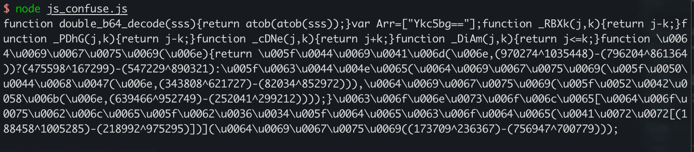

#### 0x01 说明

学习ast混淆时的练习代码，合成在一起实现了一个简单的js混淆器，支持：

- 标识符unicode编码
- 字符串加密
- 数值位异或加密
- 数组混淆
- 二项式转花指令
- 指定行加密
- 去注释/去空格

待混淆的js代码为当前路径`demo.js`中，运行完成后会在在当前路径生成一个`demoNew.js`文件

#### 0x02 笔记

详细学习过程记录【[在此](https://ainrm.cn/2022/js_ast.html)】

